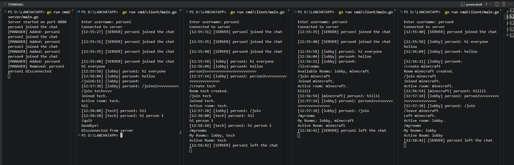

# TCP Chat Server (Go)

A terminal-based multi-client chat application built in Go using TCP sockets, goroutines, channels, and an event-driven architecture.

The project was developed as a hands-on exploration of Go networking and concurrency concepts, evolving from a simple TCP chat server into a room-based chat system with channel-driven state management and zero shared-state mutex ownership.

---

## Features

### Core Chat Features

* Multi-client TCP chat server
* Real-time message broadcasting
* Unique username registration
* Duplicate username prevention
* Join and leave notifications
* Graceful client disconnect handling
* Online user listing (`/users`)
* Username renaming (`/rename`)
* Private messaging (`/msg`)
* Timestamps on all messages

### Chat Rooms (V7)

* Create rooms (`/create`)
* Join rooms (`/join`)
* Leave rooms (`/leave`)
* List available rooms (`/listrooms`)
* View joined rooms (`/myrooms`)
* Multi-room membership support
* Active room switching
* Room-based message routing
* Persistent room lifetime during server runtime

### Architecture Highlights

* Event-driven server architecture
* Channel-based communication
* Single ownership of shared state
* Request-response channel pattern
* No mutexes
* Concurrent client handling using goroutines

---

## Technologies Used

* Go (Golang)
* TCP Networking
* Goroutines
* Channels
* Event-Driven Architecture
* Concurrent Programming

---

## Architecture

The server follows Go's concurrency philosophy:

> "Don't communicate by sharing memory; share memory by communicating."

Instead of allowing multiple goroutines to modify shared state, a single goroutine (`clientManager`) owns all server state.

```text
                    +------------------+
                    |  clientManager   |
                    +------------------+
                             |
                             |
                 Owns all server state
                             |
     -------------------------------------------------
     |               |               |              |
     |               |               |              |
 joinChan       leaveChan      messageChan    request channels
     |               |               |              |
     |               |               |              |
handleClient   handleClient   handleClient   handleClient
```

### Shared State Owned by clientManager()

* Connected clients
* Room registry
* User-room memberships
* Active room tracking
* Username management

Because only one goroutine owns the state:

* No race conditions
* No mutexes required
* Predictable state transitions
* Easier reasoning about concurrency

---

## Request-Response Pattern

Several operations use a request-response channel pattern:

* Username validation
* User listing
* Username renaming
* Room creation
* Room joining
* Room leaving
* Room membership inspection

Example flow:

```text
handleClient
      |
      v
Request Channel
      |
      v
clientManager
      |
      v
Response Channel
      |
      v
handleClient
```

This enables safe state access without exposing shared data structures.

---

## Commands

### User Commands

| Command          | Description             |
| ---------------- | ----------------------- |
| `/users`         | Show online users       |
| `/rename <name>` | Change username         |
| `/quit`          | Disconnect from server  |
| `/help`          | Show available commands |

### Messaging

| Command                 | Description            |
| ----------------------- | ---------------------- |
| `/msg <user> <message>` | Send a private message |

### Room Commands

| Command          | Description                       |
| ---------------- | --------------------------------- |
| `/create <room>` | Create a new room                 |
| `/join <room>`   | Join a room and make it active    |
| `/leave <room>`  | Leave a room                      |
| `/listrooms`     | List available rooms              |
| `/myrooms`       | Show joined rooms and active room |

---

## Example Session




---

## Project Evolution

### V1

* Basic TCP server
* Multi-client communication

### V2

* Username registration
* Duplicate username prevention

### V3

* Disconnect handling
* Join/leave notifications

### V4

* Mutex-protected shared state

### V5

* Event-driven architecture
* Channel-based client manager

### V6

* Private messaging (`/msg`)
* User management commands
* Username renaming

### V7

* Chat rooms
* Multi-room membership
* Active room system
* Room-based message routing
* Request-response room management

---

## Learning Outcomes

Through this project I gained practical experience with:

* TCP networking
* Client-server architecture
* Goroutines
* Channels
* Event-driven systems
* Concurrent state management
* Request-response communication patterns
* Message routing systems
* Shared-state ownership models
* Scalable Go server design

---

## Future Improvements

* Persistent storage
* Authentication
* Message history
* WebSocket support
* Browser-based client
* Distributed server architecture

---

## Author

**Bhavya**

Built as a learning project to explore Go networking, concurrency, and event-driven backend system design.
